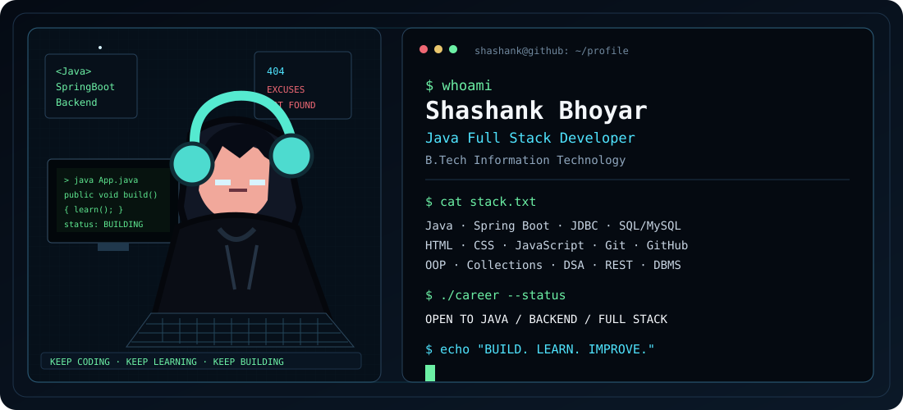
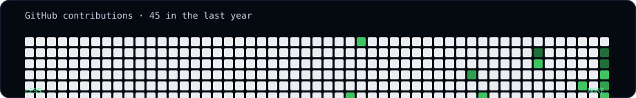

<div align="center">



</div>

# Shashank Bhoyar

**Java Full Stack Developer | B.Tech Information Technology**

I build practical applications with Java and web technologies, with a focus on backend development, SQL, REST APIs, problem solving, and clean application design.

[**View My Portfolio →**](https://shashank-bhoyar-portfolio.vercel.app/)

```text
shashank@github:~$ ./career --status

ROLE      : Java Full Stack Developer
FOCUS     : Java | Spring Boot | React | SQL
BUILDING  : Full-stack applications and REST APIs
OPEN TO   : Java | Backend | Full Stack opportunities
```

## About Me

- Java-focused developer with a strong foundation in OOP, Collections, Exception Handling, and DSA
- Building backend applications with Spring Boot, REST APIs, JPA, and SQL
- Working with React, HTML, CSS, and JavaScript for web application development
- Experienced with JDBC, MySQL, CRUD operations, validation, and database-driven applications
- Full Stack Java Development training from QSpiders

## Technical Skills

| Area | Technologies |
| --- | --- |
| Languages | Java, SQL, Python |
| Backend | Spring Boot, Spring Security, REST APIs, JDBC, Flask |
| Frontend | React, HTML, CSS, JavaScript |
| Database | PostgreSQL, MySQL |
| Core Concepts | OOP, Collections, Exception Handling, DSA, DBMS, CRUD, REST |
| Tools | Git, GitHub, Maven, Docker, Eclipse, VS Code, MySQL Workbench |
| Practices | SDLC, STLC, Testing, API documentation, CI workflows |

## Featured Projects

### ProcureFlow
**Java · Spring Boot · React · PostgreSQL · Spring Security · JWT · Docker**

Role-based procurement and inventory workflow platform covering authentication, purchase requests, manager approval, procurement operations, warehouse workflows, and inventory tracking.

[View Repository →](https://github.com/Shashankur7/procureflow)

### Employee Leave Management System
**Java · Spring Boot · Spring Data JPA · MySQL · REST APIs · Spring Security**

Backend application for employee management and leave workflows, including employee CRUD operations, leave requests, status management, validation, and role-based API protection. Currently being developed as a portfolio project.

[View Project →](https://github.com/Shashankur7/Shashankur7/tree/project/employee-leave-management/employee-leave-management)

### Safe Rail AI System
**Python · Flask · OpenCV · YOLOv8**

AI-based railway track hazard detection prototype that uses computer vision to identify obstructions, assess risk, log incidents, and support emergency alerts.

[View Repository →](https://github.com/Shashankur7/safe-rail-ai-system)

### Core Java Practice
**Java · OOP · Collections · DSA**

Structured collection of Java programs and exercises covering core Java concepts, problem solving, arrays, recursion, OOP's, and related fundamentals.

[View Repository →](https://github.com/Shashankur7/core-java-practice)

## GitHub Activity

<div align="center">



</div>

The contribution heatmap is regenerated automatically through GitHub Actions.

## Currently Learning

- Advanced Spring Boot application development
- REST API design and backend architecture
- Data Structures and Algorithms
- Production-oriented full-stack development

## Training

**Full Stack Java Development — QSpiders**

Focused on Java development, SQL, web technologies, database connectivity, Spring Boot, and full-stack application fundamentals.


## Career Focus

Open to entry-level opportunities in:

- Java Development.
- Backend Development.
- Java Full Stack Development.

## Connect

[LinkedIn](https://www.linkedin.com/in/shashank-bhoyar/) · [GitHub](https://github.com/Shashankur7) · [Email](mailto:bhoyarshashank4@gmail.com)

---

<div align="center">

**BUILD · LEARN · IMPROVE**

</div>
